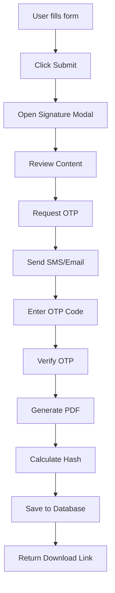

# 🔐 מערכת חתימה דיגיטלית מאובטחת
### Digital Signature System for Health Declarations


## 📋 תוכן עניינים

- [סקירה כללית](#סקירה-כללית)
- [תכונות אבטחה](#תכונות-אבטחה)
- [ארכיטקטורה](#ארכיטקטורה)
- [התקנה והגדרה](#התקנה-והגדרה)
- [שימוש במערכת](#שימוש-במערכת)
- [API Documentation](#api-documentation)
- [אבטחה ותקנות](#אבטחה-ותקנות)
- [פתרון בעיות](#פתרון-בעיות)

## 🔍 סקירה כללית

מערכת חתימה דיגיטלית מתקדמת עבור הצהרות בריאות, המספקת:

- **אימות דו-שלבי (2FA)** באמצעות SMS/Email OTP
- **חתימה קריפטוגרפית** עם SHA-256 hashing
- **Audit Trail מלא** עם תיעוד כל פעולה
- **בדיקת שלמות** (Tamper Detection) למסמכים
- **תאימות לתקנות** GDPR ודרישות חוקיות

## 🛡️ תכונות אבטחה

### אימות וזיהוי
- **OTP (One-Time Password)** בן 6 ספרות
- **Rate Limiting** מתקדם למניעת התקפות
- **IP Whitelisting** לפעולות רגישות
- **Session Management** מאובטח
- **HTTPS Enforcement** בסביבת ייצור

### הצפנה ושלמות
- **SHA-256 Hashing** עבור תוכן המסמכים
- **Digital Fingerprinting** עבור קבצי PDF
- **Cryptographic Signatures** עם AES-OTP
- **Tamper Detection** - זיהוי שינויים במסמך

### Audit Trail
- **IP Address Logging** לכל פעולה
- **User-Agent Tracking** לזיהוי מכשירים
- **Timestamp Records** מדויקים
- **Action Logging** מפורט
- **Retention Policy** לתיעוד ארוך טווח

## 🏗️ ארכיטקטורה

### Backend Components
```
├── models/
│   ├── OtpToken.js          # OTP tokens with TTL
│   └── SignedDeclaration.js # Signed documents metadata
├── routes/
│   └── esign.js            # Digital signature endpoints
├── services/
│   ├── smsService.js       # SMS/Twilio integration
│   └── emailService.js     # Email/SMTP integration
├── middleware/
│   └── security.js         # Security & rate limiting
└── storage/
    └── signed-documents/    # PDF storage directory
```

### Frontend Components
```
├── components/
│   └── HealthDeclarationSignModal.jsx  # Signature modal
└── pages/
    └── website/
        └── HealthDeclaration.jsx       # Main form with signature
```

### Data Flow


## ⚙️ התקנה והגדרה

### 1. Dependencies Installation
```bash
# Backend
cd server
npm install pdfkit express-rate-limit bcryptjs twilio nodemailer

# Frontend (already included)
# mui components, crypto utilities
```

### 2. Environment Configuration
העתק את `env.example.digital-signature` ועדכן את הערכים:

```env
# Required for OTP
TWILIO_ACCOUNT_SID=your_twilio_sid
TWILIO_AUTH_TOKEN=your_twilio_token
TWILIO_FROM_NUMBER=+1234567890

# Email configuration
EMAIL_HOST=smtp.gmail.com
EMAIL_USER=your_email@gmail.com
EMAIL_PASS=your_app_password

# Security
JWT_SECRET=your_super_secret_key_min_32_chars
HTTPS_REQUIRED=true
```

### 3. Database Setup
המערכת יוצרת אוטומטית את הטבלאות הנדרשות:
- `otptokens` - OTP tokens with TTL
- `signeddeclarations` - Signed documents metadata

### 4. Storage Directory
יש ליצור תיקיית אחסון:
```bash
mkdir -p storage/signed-documents
chmod 755 storage/signed-documents
```

## 🚀 שימוש במערכת

### For End Users

1. **מילוי הצהרת בריאות**
   - מלא את כל השדות הנדרשים
   - לחץ "שלח הצהרה"

2. **תהליך חתימה דיגיטלית**
   - סקור את תוכן ההצהרה
   - לחץ "המשך לאימות זהות"
   - קבל קוד אימות ב-SMS/Email
   - הזן את הקוד ולחץ "חתום על המסמך"

3. **קבלת מסמך חתום**
   - הורד את ה-PDF החתום
   - שמור עותק לארכיון האישי

### For Therapists

1. **צפייה בהצהרות**
   - ג'ש לדף "הצהרות בריאות" בדאשבורד
   - סקור הצהרות ממתינות

2. **אימות מסמכים**
   - השתמש ב"אימות שלמות מסמך"
   - בדוק SHA-256 hash integrity

3. **הורדת מסמכים**
   - לחץ "הורד מסמך" עבור PDF חתום
   - השתמש ב"צפה במסמך" לתצוגה מקוונת

## 📚 API Documentation

### POST /api/esign/otp/start
יצירת OTP ושליחתו למשתמש.

**Request:**
```json
{
  "payload": "stringified JSON of declaration data",
  "channel": "sms" | "email"
}
```

**Response:**
```json
{
  "success": true,
  "sentTo": "masked phone/email",
  "channel": "sms"
}
```

### POST /api/esign/otp/verify
אימות OTP ויצירת PDF חתום.

**Request:**
```json
{
  "payload": "same stringified JSON",
  "code": "123456"
}
```

**Response:**
```json
{
  "success": true,
  "signedDocumentId": "uuid",
  "downloadUrl": "/api/esign/download/uuid",
  "signedAt": "2024-01-01T12:00:00Z",
  "fileSize": 12345
}
```

### GET /api/esign/download/:documentId
הורדת PDF חתום.

**Response:** Binary PDF file

### POST /api/esign/verify-integrity
בדיקת שלמות מסמך.

**Request:**
```json
{
  "signedDocumentId": "uuid"
}
```

**Response:**
```json
{
  "success": true,
  "valid": true,
  "details": {
    "hashMatch": true,
    "status": "active",
    "expired": false
  }
}
```

## 🔒 אבטחה ותקנות

### Rate Limiting
- **OTP Requests:** 5 per 10 minutes
- **Signature Operations:** 10 per 30 minutes
- **Download Requests:** 20 per hour
- **General API:** 100 per 15 minutes

### Data Protection
- **GDPR Compliant:** Full data protection
- **Right to be Forgotten:** Secure deletion
- **Data Minimization:** Only necessary data stored
- **Retention Policy:** 7 years for medical records

### Security Headers
```javascript
{
  "Strict-Transport-Security": "max-age=31536000",
  "X-Content-Type-Options": "nosniff",
  "X-Frame-Options": "DENY",
  "X-XSS-Protection": "1; mode=block",
  "Content-Security-Policy": "default-src 'self'"
}
```

### Audit Logging
כל פעולה מתועדת עם:
- Timestamp (ISO 8601)
- User ID
- IP Address
- User-Agent
- Action Type
- Success/Failure status

## 🔧 פתרון בעיות

### שגיאות נפוצות

#### "OTP לא נשלח"
```bash
# בדוק הגדרות Twilio/Email
echo $TWILIO_ACCOUNT_SID
echo $EMAIL_USER

# בדוק לוגים
tail -f logs/app.log | grep OTP
```

#### "קובץ PDF לא נוצר"
```bash
# בדוק הרשאות תיקייה
ls -la storage/signed-documents/
chmod 755 storage/signed-documents/

# בדוק שטח דיסק
df -h
```

#### "אימות שלמות נכשל"
```bash
# בדוק SHA-256 מקורי מול נוכחי
node -e "
const crypto = require('crypto');
const fs = require('fs');
const data = fs.readFileSync('path/to/file.pdf');
console.log(crypto.createHash('sha256').update(data).digest('hex'));
"
```

### Monitoring Commands

```bash
# בדיקת סטטוס מערכת
curl http://localhost:5000/api/health

# בדיקת rate limiting
curl -v http://localhost:5000/api/esign/otp/start

# בדיקת storage
du -sh storage/signed-documents/
```

### Performance Optimization

1. **Database Indexing**
   ```javascript
   // MongoDB indexes
   db.otptokens.createIndex({ "userId": 1, "payloadHash": 1 })
   db.signeddeclarations.createIndex({ "userId": 1, "signedAt": -1 })
   ```

2. **File Cleanup Job**
   ```bash
   # Cron job לניקוי קבצים ישנים
   0 2 * * * find storage/signed-documents -mtime +2555 -delete
   ```

## 📞 תמיכה

לשאלות ותמיכה טכנית:
- Email: support@wellness-platform.com
- Documentation: [Link to docs]
- Issue Tracker: [GitHub Issues]

## 📄 רישיון

מערכת זו מוגנת בזכויות יוצרים ומיועדת לשימוש פנימי בלבד.

---

**⚠️ הערת אבטחה:** מערכת זו מטפלת במידע רגיש של מטופלים. יש לוודא שכל ההגדרות האבטחה מופעלות בסביבת ייצור.
